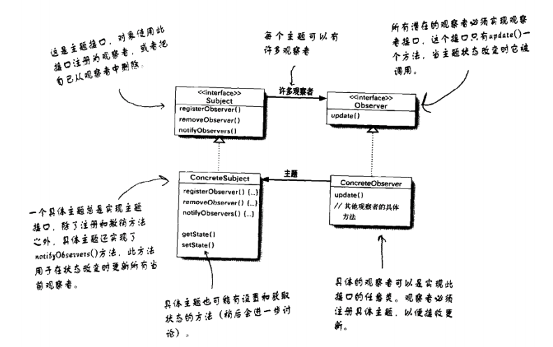

[TOC]

# 观察者模式
* 约定
    * 主题(Subject)：出版者、被观察者、
    * 观察者(Observer)：订阅者、
    * 具体主题(Concrete Subject): 对主题的实现
    * 具体观察者(Concrete Observer): 对观察者的实现

* 定义：定义了对象之间的`一对多`依赖，这样依赖，当一个对象改变状态时，它的所有依赖者都会收到通知并自动更新。
* 类图：

> 观察者模式就和报纸订阅/取消订阅、邮件订阅/取消订阅类似。
> 出版者（主题）+ 订阅者（观察者）=观察者模式

## 2. 解决什么问题？
* 解决一个对象状态改变通知其他多个对象的问题。（易用、低耦合、高度协作）

## 3. 如何解决？

## 4. 优缺点是什么？
### 4.1 优点
* 支持`一对多`通信。
* 符合`开闭原则`。
* 在主题和观察者之间建立一个抽象的耦合。【抽象的耦合？？？】

### 4.2 缺点
* 当一个`主题`的`观察者`过多时，通知会比较耗费时间。
* 当 `主题` 和 `观察者`有循环依赖时，会导致循环调用。
* `观察者`无法知道变化过程，只能知道变化结果。

## 5. 使用场景是什么？
* 一个对象要通知其他[多个]对象自己改变时（可能并不知道这些对象是谁）；
* 一个对象要导致其他[多个]对象自己改变时；
* 需要创建触发链时；

## 6. 应用实例？
* 天气预报服务器数据更新，客户端实时展示更新后的数据。（《Head First设计模式》示例）
* 电子商务网站向多个用户推送商品信息。

## 7. 拓展
* 观察者模式有：`推`和`拉`两种模式。
    * 推：`主题`将变更`推送`给`观察者`；
    * 拉：`主题`通知`观察者`已变更，变更内容由`观察者`主动获取。（`主题`提供获取接口）
* 开闭原则：对修改关闭，对拓展开放

## x. 疑问
* `观察者`如何对感兴趣的事情进行订阅、取消订阅？
    * `主题`提供注册接口，以供观察者对主题进行订阅；
    * `主题`提供取消订阅接口，以供观察者对主题进行取消订阅；
* `主题`如何存储`观察者`？
    * 可存储在数组或其他数据结构中。
* `主题`如何通知`观察者`？
    * 遍历所有观察者，一个一个进行通知。
* `mqtt`是否也是观察者模式的一种实现？

## y. 参考
* 《Head First设计模式》
* http://www.runoob.com/design-pattern/observer-pattern.html
* https://design-patterns.readthedocs.io/zh_CN/latest/behavioral_patterns/observer.html

