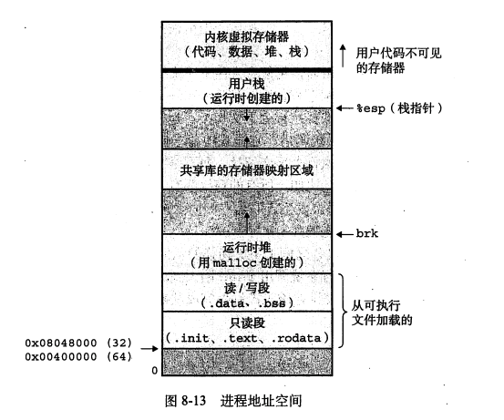
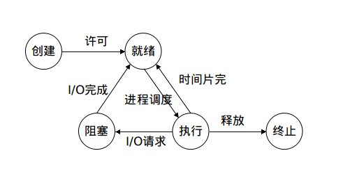

[TOC]

# 进程
进程是操作系统中最核心的概念。
* 定义：一个执行中的程序的实例。（对正在运行程序的一个抽象）
* 是资源分配的基本单位。
* 进程提供给应用程序的关键抽象：
  * 一个独立的`逻辑控制流`，它提供一个假象，好像程序独占地使用处理器。
  * 一个私有的`地址空间`，它提供一个假象，好像程序独占地使用存储器系统。
* `逻辑流(逻辑控制流）`：程序计数器PC值的序列。
  * 异常处理程序、进程、信号处理程序、线程和Java进程都是逻辑流的例子。
* `并发流(concurrent flow)`：一个逻辑流的执行在时间上与另一个流重叠。
* `并发`：多条流并发地执行的一般现象称为并发(concurrecy)。
* `多任务(multitasking)`：一个进程和其他进程轮流运行的概念称为多任务。
* `时间片(time slice)`：一个进程执行它的控制流的一部分的每一时间段。
* `并行流(parallel flow)`：两个流运行在不同的处理器上或者不同的计算机上。
* `上下文(context)`：内核重新启动一个被抢占的进程所需要的状态。
* `上下文切换`：内核为每个进程维护一个`上下文(context)`，多任务的实现依赖上下文切换。
  * 1）保存当前进程的上下文；
  * 2）恢复某个先前被抢占的进程被保存的上下文；
  * 3）将控制传递给这个新恢复的进程；

## 1.进程地址空间

* 代码段起始地址：
  * 32位：0x08048000
  * 64位：0x00400000
* 进程从用户模式变为内核模式的方法是：中断、故障、陷入系统调用。
## 1. 进程创建与终止
* 导致`进程创建`的主要事件：
    * 1）系统初始化；
    * 2）正在运行的程序执行了创建进程的系统调用；
    * 3）用户请求创建一个新进程；
    * 4）一个批处理作业的初始化；
* 导致`进程终止`的主要事件：
    * 1）正常退出（自愿的）；
    * 2）出错退出（自愿的）；
    * 3）严重错误（非自愿）；
    * 4）被其他进程杀死（非自愿）；
    
## 2. 进程状态 
### 2.1 状态转换图
* 

### 2.2 基本状态
* 1）运行态：进程实际占用CPU；
* 2）就绪态：可运行；
* 3）阻塞态：除非某种外部事件发生(使进程满足运行条件)，否则进程不能运行。

### 2.3 引入的状态：
* 创建状态；
* 终止状态；
* 挂起状态；（图中没有）

## 3. 进程实现
* 进程表：操作系统维护的一张表格——一个结构数组。
* 进程表项：也称`进程控制块`，是`进程表`的表项。
* 典型系统中的一些关键字段：

|进程管理|存储管理|文件管理|
|---|---|---|
|寄存器|正文段指针|根目录|
|程序计数器|数据段指针|工作目录|
|程序状态字|堆栈段指针|文件描述符|
|堆栈指针||用户ID|
|进程状态||组ID|
|优先级|||
|调度参数|||
|进程ID|||
|父进程|||
|进程组|||
|信号|||
|...|||

## 4. 守护进程

## A.拓展
* 进程组：在类UNIX系统中，进程和它的所有子进程以及后裔进程共同组成一个进程组。

## B.参考
* https://blog.csdn.net/i_scream_/article/details/51569355
* 《Unix环境高级编程》
* 《现代操作系统》
* 《深入理解计算机系统》